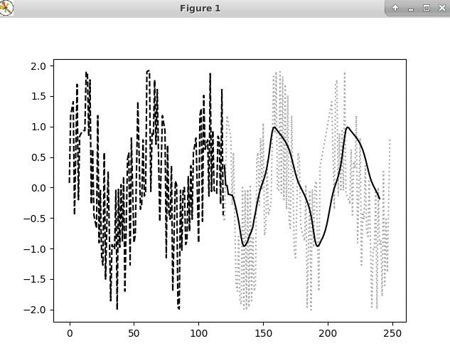

# nii-socs-dl-timeseries 

# Quick test

(Please manage to run tensorflow in your computer)
<pre>
# pip install tensorflow
# g++ gen_sin_noised.cpp
# ./a.out
</pre>

random data is written to random_data_sin.txt

<pre>
# python rnn.py random_data_sin.txt
</pre>

<pre>
[0.125333, 1.24869, 1.36812, 1.48175, -0.412215, 0.684547, 1.77051, -0.155672, 0.904827, 0.951057, 0.982287, 0.998027, 0.998027, 1.98229, 1.95106, 0.904827, 1.84433, -0.229487, 0.684547, -0.412215, -0.518246, -0.631875, 1.24869, -0.874667, 1.22465e-16, -1.12533, -1.24869, 0.631875, -1.48175, -0.587785, 0.315453, -0.770513, -1.84433, -0.904827, -0.951057, -0.982287, 0.00197327, -1.99803, 0.0177128, -0.951057, 0.0951729, -0.844328, 0.229487, -1.68455, -0.587785, 0.518246, 0.631875, -1.24869, 0.874667, 0.0, -0.874667, -0.75131, 0.368125, 1.48175, 0.587785, -0.315453, -0.229487, 0.844328, -0.0951729, -0.0489435, 1.98229, 1.99803, 1.99803, -0.0177128, 0.951057, 0.904827, 1.84433, 0.770513, 1.68455, 0.587785, -0.518246, 0.368125, 1.24869, 1.12533, 1.0, -1.12533, 0.75131, -0.368125, -0.481754, 0.412215, -1.68455, -0.770513, 0.155672, 0.0951729, -1.95106, -1.98229, 0.00197327, -0.998027, 0.0177128, 0.0489435, -0.904827, -0.844328, 0.229487, -0.684547, 0.412215, -0.481754, 0.631875, 0.75131, 0.874667, 0.0, -0.874667, 1.24869, 1.36812, -0.518246, 1.58779, 0.684547, 0.770513, 0.844328, -0.0951729, 1.95106, -0.0177128, 0.998027, -0.00197327, -0.0177128, -0.0489435, 0.904827, 0.844328, -0.229487, 1.68455, -0.412215, -0.518246, 0.368125, 1.24869, 1.12533, 1.0, 0.874667, -0.24869, 0.631875, -0.481754, -1.58779, -1.68455, -0.770513, -1.84433, -1.90483, 0.0489435, -1.98229, 0.00197327, -1.99803, 0.0177128, -1.95106, 0.0951729, -1.84433, -0.770513, -1.68455, -1.58779, 0.518246, 0.631875, -0.24869, 0.874667, 0.0, 1.12533, -0.75131, -0.631875, 0.481754, -0.412215, -0.315453, -0.229487, 0.844328, 1.90483, 0.951057, 1.98229, -0.00197327, -0.00197327, 1.98229, -0.0489435, 1.90483, -0.155672, 1.77051, -0.315453, 1.58779, -0.518246, -0.631875, 1.24869, 0.125333, -1.0, -1.12533, -0.24869, 0.631875, 0.518246, -0.587785, -0.684547, -0.770513, -0.844328, 0.0951729, -1.95106, -0.982287, 0.00197327, -1.99803, 0.0177128, -0.951057, 0.0951729, 0.155672, -0.770513, -1.68455, 0.412215, 0.518246, 0.631875, 0.75131, 0.874667, 1.0, 1.12533, 1.24869, 1.36812, 1.48175, 0.587785, -0.315453, 1.77051, 1.84433, -0.0951729, 0.951057, -0.0177128, 0.998027, -0.00197327, 1.98229, -0.0489435, -0.0951729, -0.155672, -0.229487, 0.684547, -0.412215, 0.481754, 0.368125, 1.24869, -0.874667, 1.22465e-16, 0.874667, -1.24869, -0.368125, -0.481754, 0.412215, -0.684547, -0.770513, 0.155672, -0.904827, -1.95106, -0.982287, -0.998027, 0.00197327, -1.98229, 0.0489435, -0.904827, -0.844328, -1.77051, 0.315453, -1.58779, -0.481754, -1.36812, -0.24869, 0.874667]
WARNING:tensorflow:From rnn.py:47: __init__ (from tensorflow.python.ops.rnn_cell_impl) is deprecated and will be removed in a future version.
Instructions for updating:
This class is equivalent as tf.keras.layers.SimpleRNNCell, and will be replaced by that in Tensorflow 2.0.
2019-11-28 18:17:28.515486: I tensorflow/core/platform/cpu_feature_guard.cc:141] Your CPU supports instructions that this TensorFlow binary was not compiled to use: AVX2 AVX512F FMA

('epoch:', 0, ' loss (validated):', 0.79602444)
('epoch:', 1, ' loss (validated):', 0.78783286)
('epoch:', 2, ' loss (validated):', 0.77900374)
('epoch:', 3, ' loss (validated):', 0.770013)
('epoch:', 4, ' loss (validated):', 0.7614686)
('epoch:', 5, ' loss (validated):', 0.7543657)
('epoch:', 6, ' loss (validated):', 0.7490618)
('epoch:', 7, ' loss (validated):', 0.7463054)
('epoch:', 8, ' loss (validated):', 0.74718857)
('epoch:', 9, ' loss (validated):', 0.74911016)
('epoch:', 10, ' loss (validated):', 0.75720406)
('epoch:', 11, ' loss (validated):', 0.76675636)
('epoch:', 12, ' loss (validated):', 0.7687619)
('epoch:', 13, ' loss (validated):', 0.76883274)
('epoch:', 14, ' loss (validated):', 0.7474857)
('epoch:', 15, ' loss (validated):', 0.7333704)
('epoch:', 16, ' loss (validated):', 0.7157899)
('epoch:', 17, ' loss (validated):', 0.74873394)
('epoch:', 18, ' loss (validated):', 0.656623)
('epoch:', 19, ' loss (validated):', 0.6317241)
('epoch:', 20, ' loss (validated):', 0.77229553)
('epoch:', 21, ' loss (validated):', 0.7894433)
('epoch:', 22, ' loss (validated):', 0.67168194)
('epoch:', 23, ' loss (validated):', 0.61747557)
('epoch:', 24, ' loss (validated):', 0.60573804)
('epoch:', 25, ' loss (validated):', 0.60975856)
('epoch:', 26, ' loss (validated):', 0.6562925)
('epoch:', 27, ' loss (validated):', 0.69824)
('epoch:', 28, ' loss (validated):', 0.6471917)
('epoch:', 29, ' loss (validated):', 0.5882779)
('epoch:', 30, ' loss (validated):', 0.58302283)
('epoch:', 31, ' loss (validated):', 0.6383122)
('epoch:', 32, ' loss (validated):', 0.6628297)
('epoch:', 33, ' loss (validated):', 0.5940279)
('epoch:', 34, ' loss (validated):', 0.5812577)
('epoch:', 35, ' loss (validated):', 0.611267)
('epoch:', 36, ' loss (validated):', 0.6406426)
('epoch:', 37, ' loss (validated):', 0.6134996)
('epoch:', 38, ' loss (validated):', 0.6077491)
('epoch:', 39, ' loss (validated):', 0.5950022)
('epoch:', 40, ' loss (validated):', 0.5801277)
('epoch:', 41, ' loss (validated):', 0.57797074)
('epoch:', 42, ' loss (validated):', 0.5877327)
('epoch:', 43, ' loss (validated):', 0.6100829)
('epoch:', 44, ' loss (validated):', 0.5870675)
('epoch:', 45, ' loss (validated):', 0.5588141)
('epoch:', 46, ' loss (validated):', 0.56493413)
('epoch:', 47, ' loss (validated):', 0.6050655)
('epoch:', 48, ' loss (validated):', 0.6094713)
('epoch:', 49, ' loss (validated):', 0.57952434)
('epoch:', 50, ' loss (validated):', 0.5405301)
('epoch:', 51, ' loss (validated):', 0.5533446)
('epoch:', 52, ' loss (validated):', 0.57307154)
('epoch:', 53, ' loss (validated):', 0.57131726)
('epoch:', 54, ' loss (validated):', 0.5605952)
('epoch:', 55, ' loss (validated):', 0.55589557)
('epoch:', 56, ' loss (validated):', 0.53833073)
('epoch:', 57, ' loss (validated):', 0.5560113)
('epoch:', 58, ' loss (validated):', 0.5472872)
('epoch:', 59, ' loss (validated):', 0.547714)
('epoch:', 60, ' loss (validated):', 0.57448906)
('epoch:', 61, ' loss (validated):', 0.5599474)
('epoch:', 62, ' loss (validated):', 0.5588839)
('epoch:', 63, ' loss (validated):', 0.57769257)
('epoch:', 64, ' loss (validated):', 0.5866966)
('epoch:', 65, ' loss (validated):', 0.5575515)
('epoch:', 66, ' loss (validated):', 0.5845273)
('epoch:', 67, ' loss (validated):', 0.5570539)
EARLY STOPPING
elapsed_time:1.85887598991[sec]
elapsed_time:0.318495988846[sec]
</pre>

Matplotlib is required to show this plot.

