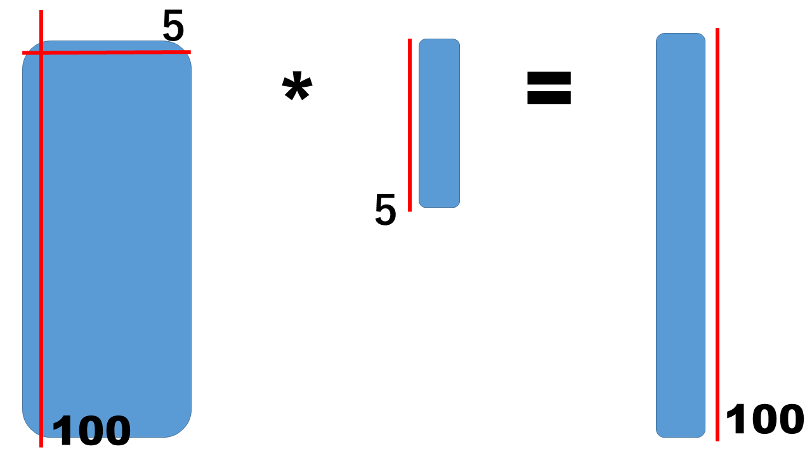

# cublasSgemv

<pre>
 66    int M = 100;
 67    int N = 5;
 
 89    cublasSgemv(handle, CUBLAS_OP_N, M, N, &alpha, dA, M, dX, 1, &beta, dY, 1);
</pre>

<pre>
# nvcc cublasSgemv_1.cu -lcublas
</pre>

<pre>
# ./a.out
6590.10
10041.88
17133.61
12606.56
7975.49
11884.11
14154.83
13064.94
14770.13
9690.33
...
elapsed time = 0.681640245 sec
</pre>