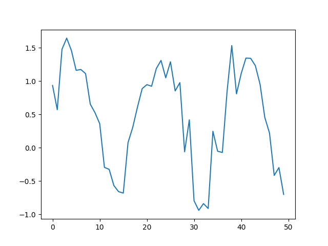
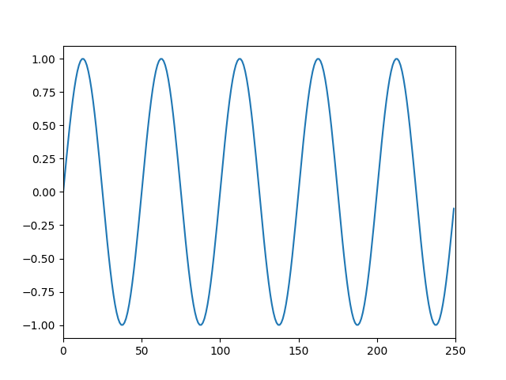

# sin wave (with some noise)
<pre>
amplitude: 1
sampling frequency: 8800
frequency: 440
duration: 5 sec
</pre>

 

# sin wave 4 (with no noise)
<pre>
F_default = 2.5
A_default = 1
fs_default = 125
</pre>

 
