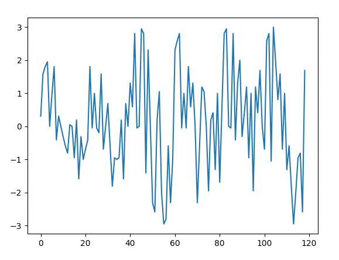
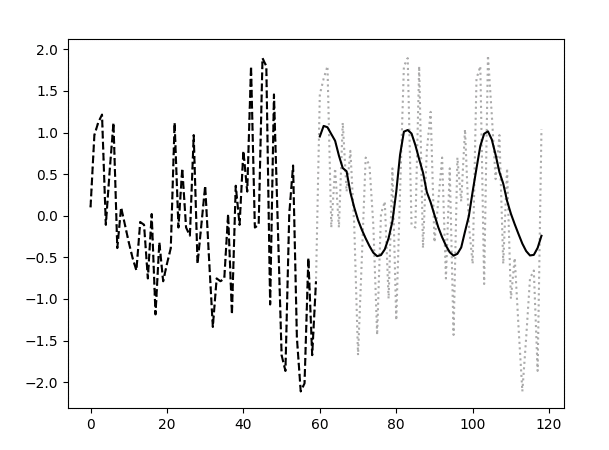

# LSTM(Long Short-Term Memory) for time-series 

<pre>
# g++ gen_sin_noised.cpp
</pre>

<pre>
# ./a.out
</pre>
random data is written to random_data_sin.txt

<pre>
# head -n 5 random_data_sin.txt
</pre>

<pre>
"2019/07/02 00:00:46.567",1
"2019/07/02 01:01:00.103",0.309017
"2019/07/02 01:01:32.670",1.58779
"2019/07/02 02:02:18.798",1.80902
"2019/07/02 02:02:23.764",1.95106
</pre>

<pre>
# python lstm.py random_data_sin.txt
[0.309017, 1.58779, 1.80902, 1.95106, 0.0, 0.951057, 1.80902, -0.412215, 0.309017, 1.22465e-16, -0.309017, -0.587785, -0.809017, 0.0489435, 0.0, -0.951057, 0.190983, -1.58779, -0.309017, -1.0, -0.690983, -0.412215, 1.80902, -0.0489435, 1.0, -0.0489435, -0.190983, 1.58779, -0.690983, 1.22465e-16, 0.690983, -0.587785, -1.80902, -0.951057, -1.0, -0.951057, 0.190983, -1.58779, 0.690983, 0.0, 1.30902, 0.587785, 2.80902, -0.0489435, 0.0, 2.95106, 2.80902, -1.41221, 2.30902, 1.22465e-16, -2.30902, -2.58779, 0.190983, 1.04894, -2.0, -2.95106, -2.80902, -0.587785, -2.30902, -1.0, 2.30902, 2.58779, 2.80902, -0.0489435, 1.0, -0.0489435, 1.80902, 0.587785, 1.30902, 1.22465e-16, -2.30902, -0.587785, 1.19098, 1.04894, 0.0, -1.95106, 0.190983, 0.412215, -1.30902, 1.0, -1.69098, 0.587785, 2.80902, 2.95106, 0.0, -0.0489435, 2.80902, -0.412215, 1.30902, 2.0, -0.309017, 0.412215, 1.19098, -0.951057, 1.0, -1.95106, 1.19098, 0.412215, 1.69098, 0.0, -0.690983, 2.58779, 2.80902, -1.04894, 3.0, 1.95106, 0.809017, 1.58779, -0.690983, 1.0, -1.30902, -0.587785, -1.80902, -2.95106, -2.0, -0.951057, -0.809017, -2.58779, 1.69098]
2019-11-30 17:36:06.172920: I tensorflow/core/platform/cpu_feature_guard.cc:141] Your CPU supports instructions that this TensorFlow binary was not compiled to use: AVX2 AVX512F FMA
('epoch:', 0, ' loss (validated):', 1.6798755)
('epoch:', 1, ' loss (validated):', 1.6758308)
('epoch:', 2, ' loss (validated):', 1.6726785)
('epoch:', 3, ' loss (validated):', 1.6694235)
('epoch:', 4, ' loss (validated):', 1.6656388)
('epoch:', 5, ' loss (validated):', 1.6615539)
('epoch:', 6, ' loss (validated):', 1.6561893)
('epoch:', 7, ' loss (validated):', 1.650825)
('epoch:', 8, ' loss (validated):', 1.6441411)
('epoch:', 9, ' loss (validated):', 1.6367563)
('epoch:', 10, ' loss (validated):', 1.6277481)
('epoch:', 11, ' loss (validated):', 1.6167511)
('epoch:', 12, ' loss (validated):', 1.6026568)
('epoch:', 13, ' loss (validated):', 1.5839807)
('epoch:', 14, ' loss (validated):', 1.5570512)
('epoch:', 15, ' loss (validated):', 1.5241154)
('epoch:', 16, ' loss (validated):', 1.4762884)
('epoch:', 17, ' loss (validated):', 1.4207081)
('epoch:', 18, ' loss (validated):', 1.3479568)
('epoch:', 19, ' loss (validated):', 1.2860607)
('epoch:', 20, ' loss (validated):', 1.2032717)
('epoch:', 21, ' loss (validated):', 1.1376581)
('epoch:', 22, ' loss (validated):', 1.1247803)
('epoch:', 23, ' loss (validated):', 1.1544209)
('epoch:', 24, ' loss (validated):', 1.1193323)
('epoch:', 25, ' loss (validated):', 1.1064413)
('epoch:', 26, ' loss (validated):', 1.05197)
('epoch:', 27, ' loss (validated):', 1.1108717)
('epoch:', 28, ' loss (validated):', 1.106287)
('epoch:', 29, ' loss (validated):', 1.1414332)
('epoch:', 30, ' loss (validated):', 1.0531689)
('epoch:', 31, ' loss (validated):', 1.0318984)
('epoch:', 32, ' loss (validated):', 1.2238566)
('epoch:', 33, ' loss (validated):', 1.1567892)
('epoch:', 34, ' loss (validated):', 1.0800147)
('epoch:', 35, ' loss (validated):', 1.0109042)
('epoch:', 36, ' loss (validated):', 1.0699668)
('epoch:', 37, ' loss (validated):', 1.1882254)
('epoch:', 38, ' loss (validated):', 1.1852747)
('epoch:', 39, ' loss (validated):', 1.092609)
('epoch:', 40, ' loss (validated):', 1.06961)
('epoch:', 41, ' loss (validated):', 1.0836989)
('epoch:', 42, ' loss (validated):', 1.1760008)
('epoch:', 43, ' loss (validated):', 1.1805283)
('epoch:', 44, ' loss (validated):', 1.171577)
('epoch:', 45, ' loss (validated):', 1.1942332)
('epoch:', 46, ' loss (validated):', 1.1034579)
EARLY STOPPING
</pre>

